# WebCrumbTrail — User guide

WebCrumbTrail is a Chrome or Brave extension (Manifest V3) that **logs visits only for domains you allow** and can attach **summaries only when you ask**. Nothing is sent to a cloud API unless you enable summarisation and click a summary action.

This guide covers **first-time setup** (OpenAI, Google Gemini, local Ollama), the **extension popup** used for capture and summaries, the **Settings** page, and the **report** layout.

---

## 1. Install and load the extension

**Prerequisites:** Node.js 18+, npm, Chrome or Brave.

1. Clone or copy the repository and open a terminal in the `extension` directory (the package under the repo root).
2. Install dependencies and build:

   ```bash
   npm install
   npm run build
   ```

3. In the browser, open `chrome://extensions` (or Brave’s equivalent).
4. Turn on **Developer mode**.
5. Click **Load unpacked** and choose the **`extension/dist`** folder (the build output, not the repo root).

After updates to the extension, run `npm run build` again and click **Reload** on the extension card.

---

## 2. First-time configuration (overview)

Before visits are stored, the page’s hostname must match your **domain allowlist** (exact host or a pattern such as `*.sharepoint.com`).

**Typical first steps:**

1. Open **Settings** (from the popup’s **Settings** button, or from the extensions list → WebCrumbTrail → **Extension options**).
2. Under **Domain allowlist**, add the sites you want to journal (see section 3 for patterns). Click **Save settings**.
3. Optionally adjust **Visit dedupe window** (minutes): repeated visits to the same page within this window count as one visit for deduplication purposes (default **5** minutes).
4. If you want API-backed summaries, enable **Enable summarisation features**, pick a **provider** (section 4), fill in URLs/keys/models, save, and run **Test API connection**.

**Privacy (short):** Visit data stays in **IndexedDB** on your machine. API keys live in **`chrome.storage.local`**. Page text is sent to your chosen provider **only** when you request a summary (or run the test). Ollama keeps traffic local.

---

## 3. Domain allowlist

- **Exact hostname:** e.g. `docs.redhat.com` matches only that host.
- **Wildcard:** e.g. `*.sharepoint.com` matches any single-level subdomain (not every possible nested pattern—keep patterns simple and test with the popup badge).
- **`www` vs apex:** `example.com` and `www.example.com` are different hosts; add both if needed.

**Quick add without opening Settings:** On an `http` or `https` tab, open the WebCrumbTrail popup and use **Add this domain to allowlist & log page**. That adds the current tab’s hostname, enables the rule if it existed but was off, and records this visit (subject to your incognito policy).

**Incognito:** Logging in incognito windows is **off** by default. Turn it on in Settings only if you have granted the extension **incognito** access in the browser.

---

## 4. Summarisation providers — examples

All provider blocks are saved in Settings; you can switch the active **API summary provider** at any time. The popup and report use whichever provider is currently selected.

### 4.1 OpenAI (or OpenAI-compatible API)

1. Create an API key (e.g. [OpenAI API keys](https://platform.openai.com/api-keys)).
2. Settings → **Enable summarisation features** → **OpenAI (cloud API)**.
3. Example values:
   - **Base URL:** `https://api.openai.com/v1`
   - **Model:** `gpt-4o-mini` (or another model your key can call)
   - **API key:** paste your secret key
4. Save, then **Test API connection**.

For a **compatible** host (Azure, local gateway, etc.), set **Base URL** to that service’s chat/completions base (often ending in `/v1`) and the **model** name that host expects.

### 4.2 Google Gemini

1. Create a key in [Google AI Studio](https://aistudio.google.com/apikey).
2. Settings → **Google Gemini**.
3. Example values:
   - **Model:** `gemini-2.0-flash` (or another model id your project supports)
   - **API key:** paste your key
4. Save, then **Test API connection**.

Summaries use Gemini’s `generateContent` HTTP API; **page text is sent to Google** when you request a summary.

### 4.3 Local Ollama

1. Install [Ollama](https://ollama.com) and pull a model, for example:

   ```bash
   ollama pull llama3.2
   ```

   Check **`ollama list`** for the exact model name.

2. Settings → **Ollama (local)**.
3. Example values:
   - **Base URL:** `http://127.0.0.1:11434/v1` (default; OpenAI-compatible path on the Ollama port)
   - **Model:** `llama3.2` (must match a pulled model)
4. Save, then **Test API connection**.

**Default port and CORS:** For **`127.0.0.1` / `localhost` / `[::1]` on port `11434`**, the extension ships **Declarative Net Request** rules that adjust the `Origin` header so Ollama accepts the call—you usually **do not** need `OLLAMA_ORIGINS` for that setup. After pulling extension updates, **`npm run build`** and **reload** the extension so rules apply.

**Custom host or port:** If Ollama listens elsewhere, configure `OLLAMA_ORIGINS` on the Ollama process (see [Ollama FAQ — additional web origins](https://docs.ollama.com/faq#how-can-i-allow-additional-web-origins-to-access-ollama)). Example for a trusted machine:

```bash
OLLAMA_ORIGINS='chrome-extension://*,moz-extension://*,safari-web-extension://*' ollama serve
```

If you see **HTTP 403** from Ollama, the server is rejecting the browser origin—prefer the default `11434` URL on loopback, or set `OLLAMA_ORIGINS` as above.

---

## 5. Extension popup — capture and summaries

Open the popup by clicking the WebCrumbTrail toolbar icon on a normal webpage.

**What you’ll see (typical layout):**

- **Header:** **WebCrumbTrail** and a **Settings** button (opens the full options page).
- **Open report viewer:** Opens the report in a new tab (filters, CSV/JSON, detail pane).
- **Allowlist status:** A badge such as **Tracked domain** or **Not on allowlist**, plus the canonical URL and (when tracked) title and visit timestamps.
- **Add this domain to allowlist & log page:** Adds the current hostname and logs this visit (http/https only).
- **Summarised / Not summarised yet:** Shows whether a completed summary exists and the raw **summary status** when not.
- **API summary:** **Request … summary** / **Refresh … summary** operate on the **currently focused tab** (the page behind the popup). Use **Refresh** after a completed summary to replace it; a plain **Request** may be rejected if a summary is already completed.
- **Manual journal (web chat):** **Copy prompt for web chat** copies an excerpt for browser chat; paste the reply into **Paste web chat reply**, then **Fill fields from pasted reply** (expects `TITLE:` / `DESCRIPTION:` lines) or type **Journal title** and **What the page covers** yourself, then **Save manual journal entry**.

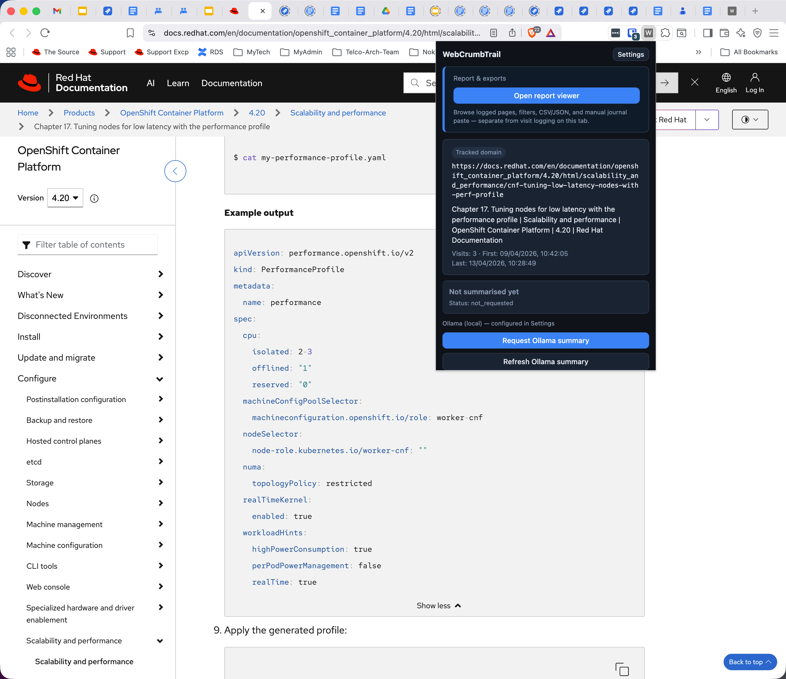  
*Figure 1 — Popup docked in the browser (overview).*

### Extension UI

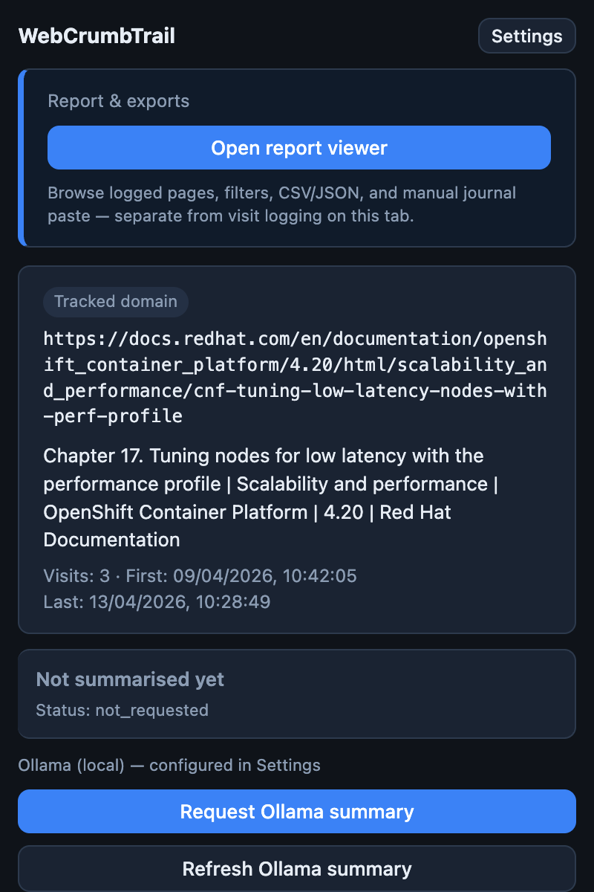

*Figure 2 — Popup: options and actions (part 1).*

### Extension UI continue...

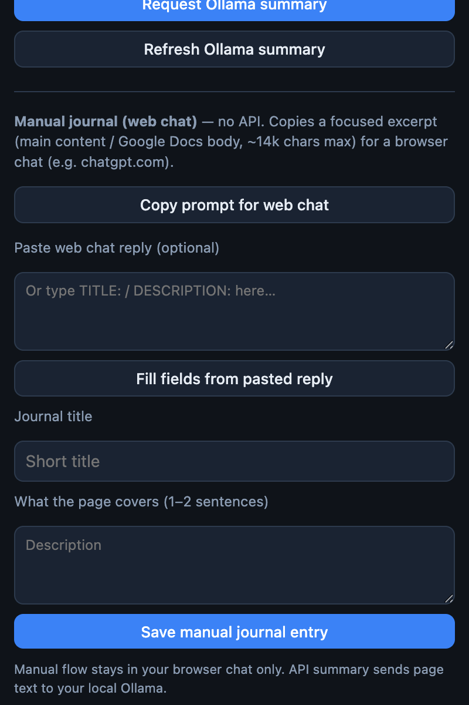

*Figure 3 — Popup: options and actions (part 2).*

### Ollama summary notification

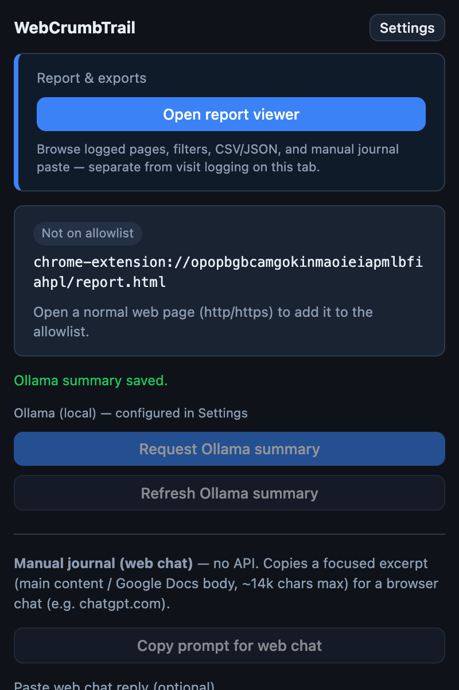

*Figure 4 — Example success message after an Ollama summary is saved.*

**Context menu:** When summarisation is enabled, you can also use the context menu action **Request WebCrumbTrail summary for this page** on a tab.

---

## 6. Settings page

Open **Settings** from the popup or the extensions list. The page is organised into:

- **Domain allowlist** — rows with pattern, enable/disable, add/remove.
- **Visit dedupe window** — minutes between counted visits for the same page.
- **Incognito** — optional allowlist logging in private windows (requires browser permission).
- **Summarisation** — master toggle, provider radio buttons (**OpenAI**, **Gemini**, **Ollama**), and the fields for the selected provider.
- **Test API connection** — saves settings, then verifies the active provider.
- Privacy note that summarisation sends page text only when you request it.

Figures:

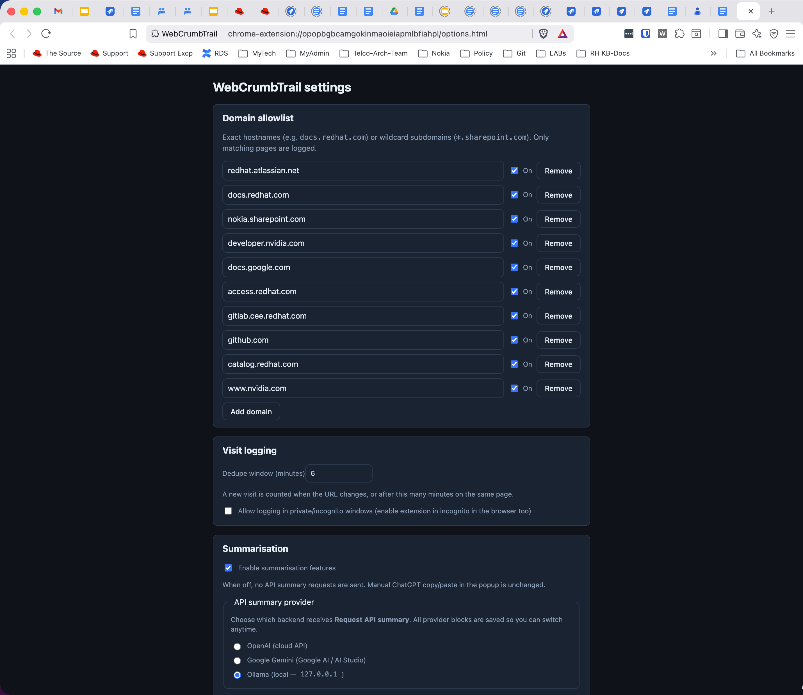  
*Figure 5 — Settings (allowlist and general behaviour).*

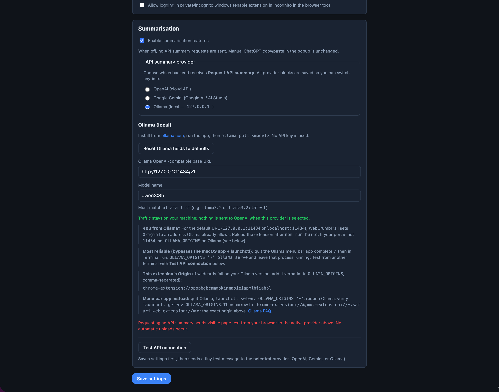  
*Figure 6 — Settings (summarisation and test).*

---

## 7. Report viewer — layout and behaviour

Open the **report** from the popup’s **Open report viewer** (or open `report.html` from the extension package).

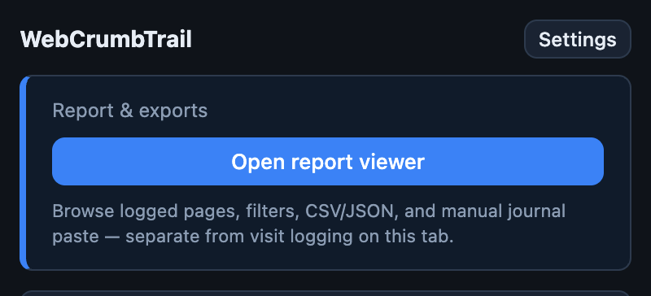

*Figure 7 — **Open report viewer** in the extension popup.*

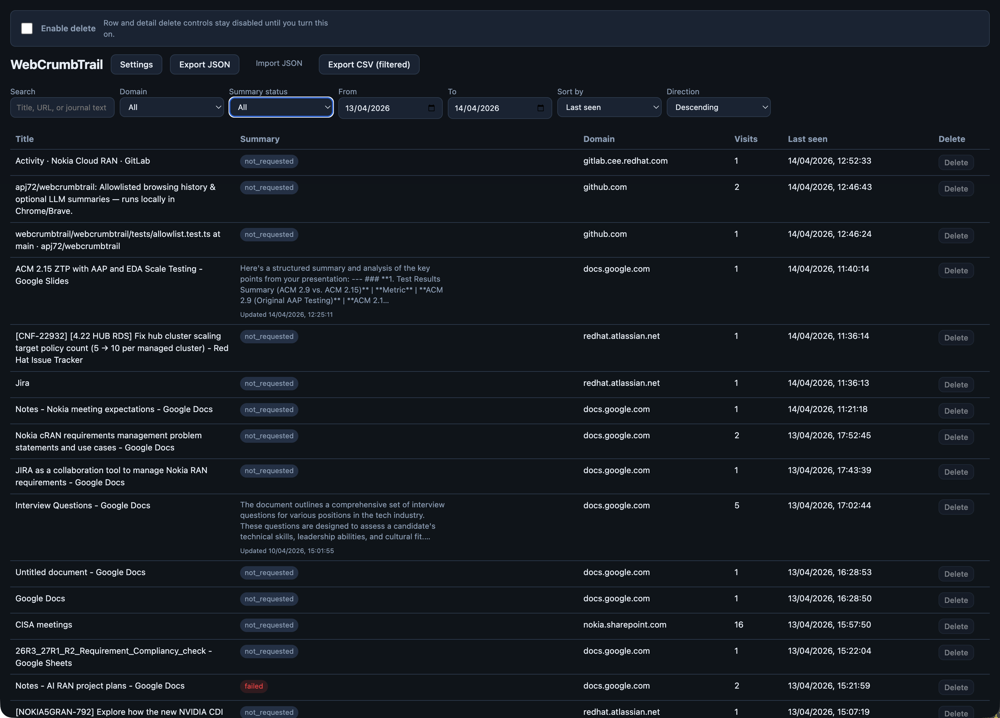

*Figure 8 — Full report: header, filters, and main table.*

### 7.1 Top bar

- **Enable delete** — **Off by default.** While off, per-row **Delete** and bulk delete are disabled so accidental clicks do not remove data. Turn on when you need to delete; turn off when finished.
- When delete is on: **Select all in table**, **Clear marks**, **Delete selected (N)** for bulk removal.
- **Settings** — opens the options page.
- **Export JSON** — full backup of stored data.
- **Import JSON** — restores from a file; the current implementation **replaces** existing **pages** and **visits** in IndexedDB, then loads the bundle (settings in the file are applied as part of import—use only trusted backups).
- **Export CSV (filtered)** — exports rows that match the **current filters**, not necessarily the whole database.

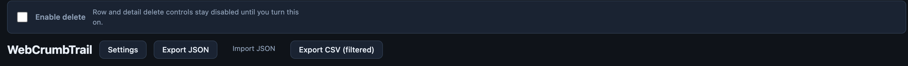

*Figure 9 — section 7.1: **Enable delete** off (default); row actions and export buttons.*

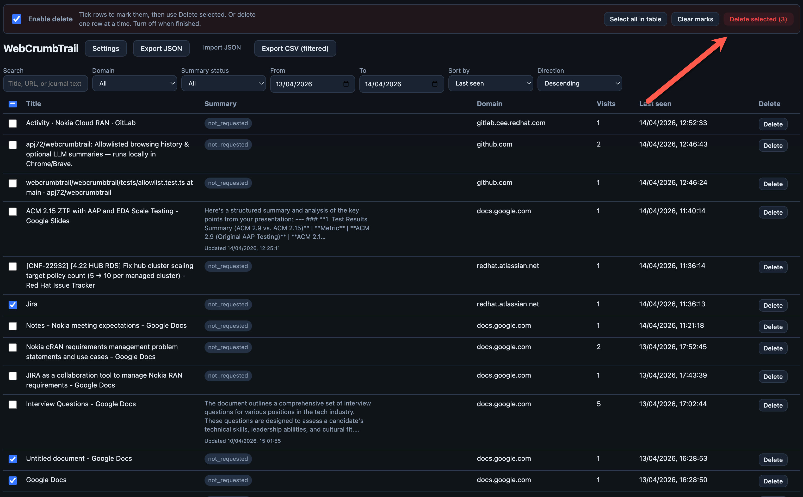

*Figure 10 — section 7.1: **Enable delete** on, rows selected, **Delete selected** available.*

### 7.2 Filters and sorting

- **Search** — matches title, URL, journal title, or summary text.
- **Domain** — restrict to one domain from your data.
- **Summary status** — `not_requested`, `queued`, `completed`, `failed`, or all.
- **From / To** — date range on **last seen** (end date is inclusive through that calendar day in the UI logic).
- **Sort by** — last seen, first seen, visit count, domain; **Direction** ascending or descending.

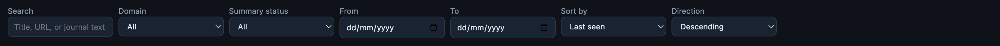

*Figure 11 — section 7.2: Filter and sort controls.*

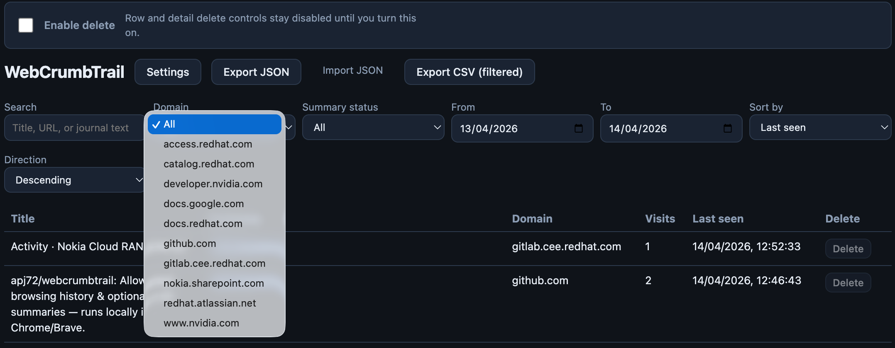

*Figure 12 — section 7.2: **Domain** filter (example: choosing one domain).*

### 7.3 Table

Columns typically include **Title**, **Summary** (preview when completed with content; otherwise a **status badge**), **Domain**, **Visits**, **Last seen**, and **Delete** (only effective when **Enable delete** is on).

- **Queued:** Work in progress for an API summary.
- **Failed:** The last API summary attempt failed; use **Refresh** from the popup or report detail after fixing connectivity or settings.
- **Completed:** Summary succeeded; the cell shows a short preview when title or body exists.

Click a row to open the **detail pane** on the right.

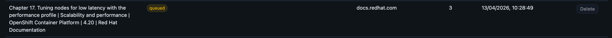

*Figure 13 — section 7.3: **Summary** column with **queued** status.*

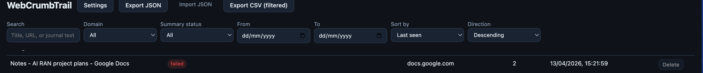

*Figure 14 — section 7.3: **Summary** column with **failed** status.*

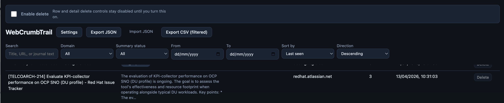

*Figure 15 — section 7.3: **Summary** column with **completed** preview text.*

### 7.4 Detail pane

- **Close detail** — collapses the pane.
- **Delete this page** — requires **Enable delete**; confirms before removing the page and all its visits.
- **Canonical URL** and **Open in new window** — opens the stored page in a **new browser window**, preferring the **last-seen URL** when available.
- Timestamps: first seen, last seen, visit count.
- **Summary** card — full title and summary text when present.
- **API summary (active tab)** — switch to a tab showing that URL, then request or refresh (same rules as the popup).
- **Manual journal (web chat)** — open URL, paste reply, **Save manual journal entry**.
- **Visit timeline** — list of visits with time and title at visit.

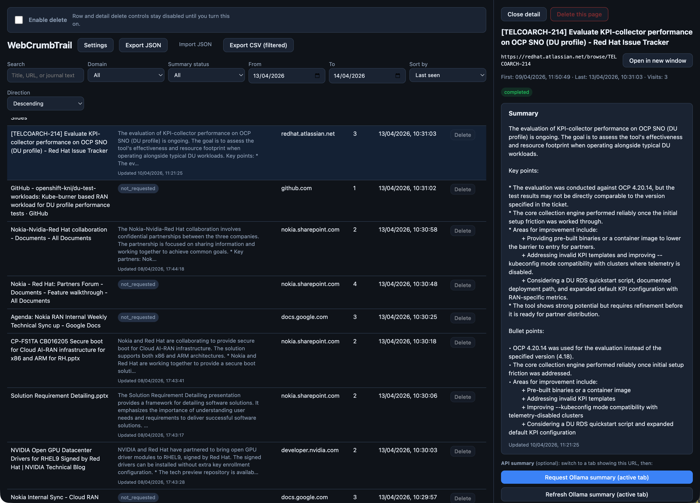

*Figure 16 — section 7.4: Table plus **detail pane** (summary, API actions, manual journal, visit timeline).*

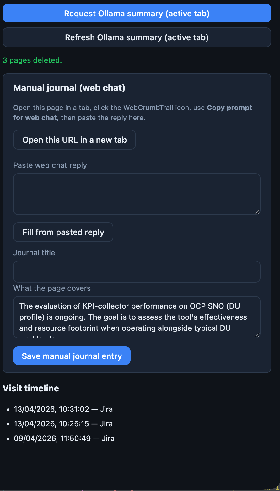

*Figure 17 — section 7.4: Lower detail area (**Manual journal**, **Visit timeline**).*

---

## 8. Troubleshooting (quick)

| Symptom | What to check |
|--------|----------------|
| No visits recorded | Hostname must match allowlist; use http/https; check incognito setting. |
| “Not on allowlist” in popup | Add domain via Settings or **Add this domain…**. |
| Summary stuck **queued** | Background work may still run; if it never completes, check network, provider status, and browser extension reload. |
| **failed** status | Open Settings → **Test API connection**; for Ollama see section 4.3 (403 / `OLLAMA_ORIGINS`). |
| Ollama 403 on non-default port | Set `OLLAMA_ORIGINS` or use default `11434` on loopback. |

---

*End of user guide.*
